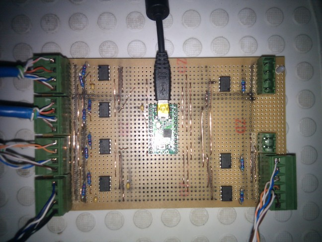
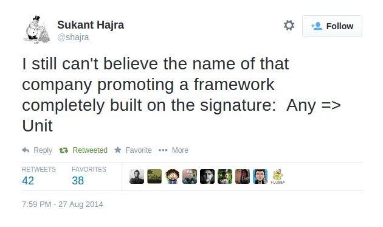
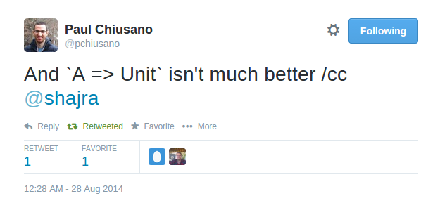

# Simple Lock-Free Transactions and Their Uses

A presentation made at scalasyd.

https://github.com/arnolddevos/FlowLib

## Why Concurrent Programming?

It is not just about the cores. The world is asynchronous.



A microcontroller collecting events from sensors around the house.

## Aim of this Talk

> Develop a minimal, general purpose concurrent programming library 
> that is functional and well typed.

## Concurrent Programming in Scala

* Akka (survivor of numerous scala actor systems)
* reactive streams
* scalaz streams
* scala Future
* scalaz Future
* scala STM (anyone used this?)
* Call out the ones not listed...

## The trouble with Akka



But it is a popular system...


## Don't Get Me Started...



See my "Erlang Style" blog for examples of the problem.

## Concurrent vs. Functional

Concurrent | Functional
---|---
Asynchronously evolving state variables. | No mutable state.
Synchronization is an effect. | No side effects.


Please don't make me go back to while loops :-(

## What Would SPJ Do?


## How Should We Proceed?

> manage the effects and state using a structure built from pure functions

## Keeping it Simple

* Keep __synchronization__ separate from...

* concurrent __process definition__, separate from...

* asynchronous __execution__, separate from...

* __error__ handling. 

## Ingredients for this Cooking Session

Lock Free* | Blocking
---|---
java.util.concurrent.atomic. `AtomicReference`| `synchronized(obj); wait(); notify()`
java.util.concurrent. `ExecutorService`| java.lang.`Thread`

*We will be using this column.

## Compare and Set

```scala
type T
val t0: T
val ref = new AtomicReference[T](t0)

def transact(f: T => T) = {
  @tailrec
  def attempt(): T = {
    val t = ref.get
    if( ref.compareAndSet(t, f(t))) t else attempt()
  }
  attempt()
}
```

## Eg Concurrent Accumulator

```scala
def ff[T:Monoid](t: T): T => T = Monoid.plus(_, t)

// on thread 1
ts1 foreach { t => transact(ff(t)) }

// on thread 2
ts2 foreach { t => transact(ff(t)) }

// later...
val sum = transact(identity)

```

## Suspending Execution in Threads

```scala
obj.wait(); // suspend everything after the ";" in a Thread object
theRestOfTheComputation();

// and later on another thread...
obj.notify(); // resume the suspended Thread
```

As seen in java.util.concurrent.BlockingQueue

```scala
val item = blockingQueue.take();
k(item); // suspended until item available
```

## Suspending Execution in Thunks

```scala
type V
type T = Either[Queue[V => Unit], Queue[V]]
val t0 = Left(Queue())

def take( k: V => Unit): Unit = {
  transact {
    case Left(ks)  => Left(ks :+ k)
    case Right(ts) if ! ts.isEmpty => Right(ts.tail)
    case _ => Left(Queue(k))
  } match {
    case Right(ts) if ! ts.isEmpty => k apply ts.head
    case _ =>
  }
}

// ...
take(k) // k is suspended until a V is available

```

## Scala STM Suspends Transactions 

```scala
val someCondition = Ref(false)

new Thread {
    public void run() {
        // ...
        atomic { implicit txn =>
            if (! someCondition())
                retry // wait for something to change
            continueWithConditionSatisfied
}
```
The retry operator is nice, but programming with `Ref`'s is not functional.

# A Transaction Abstraction

## A Transaction Abstraction

```scala
trait Transaction[T] {
  def transition: T => Option[T]
  def effect: T => Unit
}

trait Transactor[T] {
  def run(r: Transaction[T]): Unit
}
```

#### Specification:
* transactor state is __updated__ if transition returns Some(_)
* transaction __retried__ if transition returns None
* effects run with same input as successful transition
* effects __happen after__ the transition

## Implementation Sketch

```scala
case class State(t: T, rs: List[Transaction[T]])
val cell = new AtomicReference(State(t0, Nil))

def run( r: Transaction[T] ): Unit = {
  def attempt: Unit = {
    val State(t0, rs) = cell.get
    r.transition(t0) match {
      case Some(t1) =>
        if( ! cell.compareAndSet(State(t1, Nil)))
          attempt()
        else {
          r.effect(t0)
          rs.foreach(run)
        }
      case None =>
        if(! cell.compareAndSet(State(t0, r :: rs0)))
          attempt()
    }
}
```

## Lets Use It

First, a convenience method for Transactor:

```scala
def transact(pf: PartialFunction[T, T])(k: T => Unit) =
  run {
    new Transaction[T] {
      val transition = pf.lift
      val effect = k
    }
  }
}
```

## Here is a semaphore ...

```scala
val v0: Long
val state = Transactor(v0)

// P or wait
def take( k: Long => Unit): Unit =
  state.transact { case v if v > 0 => v -1 } { k }

// V or signal
def offer(i: Long)(k: => Unit): Unit =
  state.transact { case v => v + i } { _ => k }
```

## A channel looks pretty simple...

```scala
import scala.collection.immutable.Queue
val backlog: Int
val state = Transactor(Queue[T]())

def take( k: T => Unit): Unit =
  state.transact { 
    case q if ! q.isEmpty => q.tail 
  } { 
    q => k(q.head)
  }

def offer(t: T)(k: => Unit): Unit =
  state.transact { 
    case q if q.length < backlog => q enqueue t 
  } { 
    _ => k 
  }
```

## A synchronized variable ...

```scala
val initial: Option[T]
val state = Transactor(initial)

def take( k: T => Unit): Unit =
  state.transact { case ot @ Some(_) => ot } { _ foreach k }

def offer(ot: Option[T])(k: => Unit): Unit =
  state.transact { assign(ot) } { _ => k }
```

## A (cyclic) barrier ...

```scala
val state = Transactor(0l)

def take( k: Long => Unit): Unit =
  state.transact { noChange } { v0 =>
    state.transact { case v1 if v1 > v0 => v1 } { k }
  }

def offer(u: Unit)(k: => Unit): Unit =
  state.transact { case v0 => v0 + 1 } { _ => k }
```

## A latch ...

```scala
val state = Transactor(None: Option[T])

def take( k: T => Unit): Unit =
  state.transact { 
    case ot @ Some(_) => ot 
  } { 
    _ foreach k 
  }

def offer(t: T)(k: => Unit): Unit =
  state.transact { 
    case ot @ Some(_) => ot 
    case None => Some(t) 
  } { 
    _ => k 
  }
```

## A Y (wye, rendezvous) ...

```scala
trait State
case object Empty extends State
case class Half(t1: T1) extends State
case class Full(t12: (T1,T2)) extends State

private val state = Transactor(Empty: State)

def take(k: ((T1, T2)) => Unit): Unit =
  state.transact { case Full(_) => Empty } { case Full(t12) => k(t12) }

def offer(et: Either[T1,T2])(k: => Unit): Unit = et match {
  case Left(t1) =>
    state.transact { case Empty => Half(t1) } { _ => k }
  case Right(t2) =>
    state.transact { case Half(t1) => Full((t1, t2)) } { _ => k }
}
```

# A Process Abstraction

## Option 1: Using scalaz.concurrent.Future

```scala
import scalaz.concurrent.Future
import Future.async

val input: Channel[String]
val output: Channel[String]

def headLines(n: Int): Future[Nothing] = 
  async(input.take) flatMap { line =>
    if(n == 0) headLines(0)
    else 
      async[Unit]{
        k => output.offer(line)(k(()))
      } flatMap { _ =>
        headLines(n-1)
      }
  }
```

## Option 2: A Reasonably Priced Monad

Free is the essence of sequential operation aka _flatmappyness_.

```scala
sealed trait Free[V[_], +A]
case class Return[V[_], +A](a: A) extends Free[V,A]
case class Bind[V[_], A, +B](va: V[A], f: A => Free[V,B]) extends Free[V,B]
```

* A `V[A]` is an _instruction_ to produce an `A`.
* A `Free[V,B]` is a _process_ that will produce a `B`.
* `A => Free[V, B]` is a _step_ in the process.

Check out Runar Bjarnason scaladays talk "Compositional Application Architecture With Reasonably Priced Monads".

https://dl.dropboxusercontent.com/u/4588997/ReasonablyPriced.pdf

## Free flatmap just records a function.

```scala
def flatMap[B](f: A => Free[V,B]): Free[V,B] = this match {
  case Return(a) => f(a)
  case Bind(vx, g) => Bind(vx, g andThen (_ flatMap f))
}

```
* A `V[A]` is an "instruction" to produce an `A`.
* A `Free[V, B]` is a process

    * using instruction set `V`
    * to ultimately produce a `B`

## Executing the process

```scala
def foldMap[V[_],W[_]:Monad, A](ma: Free[V,A])(f: V ~> W): W[A] = {
  ma match {
    case Return(a) => Monad[W].point(a)
    case Bind(fx, g) =>
      Monad[W].bind(f(fx)) { a =>
        foldMap(g(a))(f)
      }
  }
}
```

## Option 3: A Process Monad I knocked together in the back shed.

```scala

sealed trait Process[+U] extends Process.ProcessOps[U]

// a constant process
case class Complete[U](u: U) extends Process[U]

// one process after another
case class Sequential[V, U]( process: Process[V], 
  step: V => Process[U]) extends Process[U]
```
## It can Trampoline

```scala
// a trampoline
case class Ready[U]( step: () => Process[U] ) extends Process[U]
```

## Errors captured, handled by executor

```scala
// failed state triggers error handling
case class Failed(e: Throwable) extends Process[Nothing]

// naming  processes helps diagnostics
case class Named[U](name: String, step: Process[U]) 
    extends Process[U] {
  override def toString = s"Process($name)"
}
```

## Concurrent Processing

```scala
// states for concurrent processes
case class Waiting[U]( respond: (U => Unit) => Unit) 
  extends Process[U]

case class Asynchronous[U]( step: () => Process[U] ) 
  extends Process[U]
  
case class Parallel( p1: Process[Any]) 
  extends Process[Unit]
```

## Process Executor is Separate

```scala
trait Site {
  def success[U](p0: Process[U], u: U): Unit
  def failure[U](p0: Process[U], e: Throwable): Unit
  def executor: ExecutorService
  def run[U](p0: Process[U]): Unit = ...
}
```

A _family_ of processes is executed at `Site`.

## Eg:

```scala
def adder(total: Int=0): Process[Int] = receive(inputQ) >>= {
  case i if i > limit => send(actionQ, i) >>  adder(total)
  case i if i < 0     => fail("negative reading")
  case i if i == 0   => stop(total)
  case i              => adder(total + i)
}
adder().run
```

## Higher Order Processes

```scala
type Input[A] = Process[A]
type Output[A] = A => Process[Unit]

type Row
type Sum

def foldRows: 
  Input[Row] => Output[Sum] => Process[Nothing] = ...

def generateRows: 
  Output[Row] => Process[Nothing] = ...
```

## Wiring it Up

```scala
val backlog: Int
val rows = channel[Row](backlog)
val sums = channel[Sum](backlog)

Site run {
  generateRows :-> rows &
  rows ->: foldRows :-> sums
}
```

The `&` runs processes in parallel.  
The `->:` and `:->` apply inputs and outputs 
to the process definitions.


## In Summary

We went from AtomicReference to Transaction ultimately creating
lock free versions of common concurrent programming types.

We borrowed or built a Process monad that
runs process steps in an ExecutorService.

Result is a minimal, general purpose concurrent programming library 
that is functional and well typed.

@a4dev

https://github.com/arnolddevos/FlowLib

http://notes.backgroundsignal.com/Transactor.html#/

## Aside: Java Memory Model

* Each action in a thread happens before every action in that thread that comes later in the program's order.
* An unlock on a monitor happens before every subsequent lock on that same monitor.
* A write to a volatile field happens before every subsequent read of that same volatile.
* A call to start() on a thread happens before any actions in the started thread.
* All actions in a thread happen before any other thread successfully returns from a join() on that thread.

## Aside: It is all about the cache

Core i7 Xeon 5500 Series Data Source Latency (approximate)

* L1 CACHE hit, ~4 cycles
* L2 CACHE hit, ~10 cycles
* L3 CACHE hit, line unshared ~40 cycles
* L3 CACHE hit, shared line in another core ~65 cycles
* L3 CACHE hit, modified in another core ~75 cycles remote
* Remote L3 CACHE ~100-300 cycles
* Local Dram ~60 ns
* Remote Dram ~100 ns
